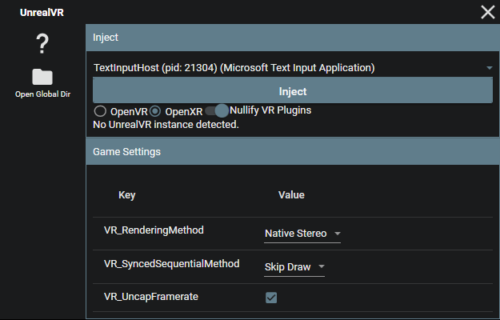
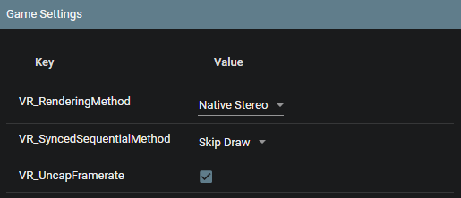
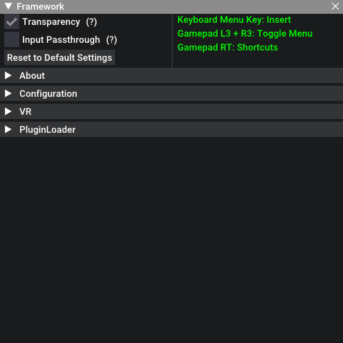
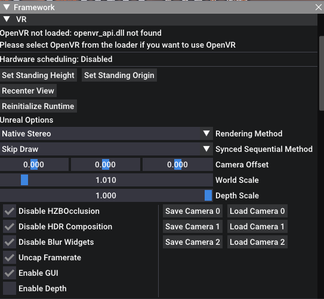
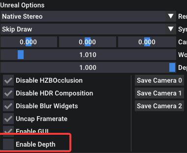
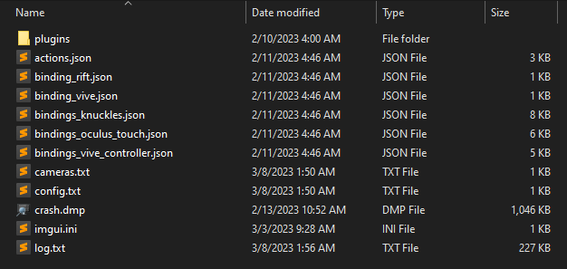

# UnrealVR: In-Depth Guide

Dive deeper into the UnrealVR and learn how to fine-tune your VR experience with this comprehensive guide. We'll explore various settings, configurations, and troubleshooting tips to help you get the most out of your favorite Unreal Engine games in VR.

## Frontend GUI

The frontend GUI provides an intuitive interface for injecting VR functionality into your chosen game. Here, you can:

1. Select a process to inject into
2. Choose your desired runtime (OpenVR/OpenXR)
3. Toggle VR plugins (if necessary)
4. Configure pre-injection settings

## Pre-Injection Settings

Before injecting, you can customize the following settings:

- `VR_RenderingMethod`: Choose from Native Stereo, Synchronized Sequential, or Alternating/AFR
- `VR_SyncedSequentialMethod`: Configure the behavior of the Synced Sequential rendering method
- `VR_UncapFramerate`: Enable or disable framerate uncapping

After injection, the rest of the options will populate automatically. You can modify these settings in the in-game menu or through the `config.txt` file.

## In-Game Menu

The in-game menu offers additional configuration options and shortcuts for adjusting settings on the fly. Access the menu by pressing the **Insert** key or **L3+R3** on a controller.

The in-game menu can be accessed either inside the VR headset, or you can use the desktop view to adjust settings without having to put on a headset.

### In-Game Shortcuts

While holding **RT**:

- RT + Left Stick: Move the camera left/right/forward/back
- RT + Right Stick: Move the camera up/down
- RT + B: Reset camera offset
- RT + Y: Recenter view
- RT + X: Reset standing origin

## CVars and Fixes

Use the in-game menu to access and modify various CVars for fixing broken shaders and effects. The tool offers a range of options for addressing common rendering issues.

## Depth Buffer Integration

While depth buffer integration is disabled by default, enabling it can greatly improve latency on Oculus headsets when using OpenXR. To enable depth buffer integration, adjust the `VR_EnableDepth` setting.

## Configurations

All configurations are stored on a per-game basis in the `%APPDATA%/UnrealVRMod` directory. You can modify settings directly in the UI or through the `config.txt` file. This directory can be accessed in the frontend GUI by clicking the "Open Global Dir" button.

### Plugins

Plugins can be installed in the `plugins` folder in the game's configuration directory. Simply drop the plugin dll into it.

## Troubleshooting & Optimization

For optimal performance and compatibility:

- Tweak graphical settings in-game to reduce load
- Experiment with different rendering methods if you encounter rendering bugs or crashes
- Use the in-game menu and CVars to address shader and effect issues
- Enable depth buffer integration for improved latency on Oculus headsets (OpenXR only)
- Consider upgrading your system for the best experience with high-end AAA titles

Further tweaks can be done by modifying the game's INI files, using UUU, UE4SS, or other external tools. Various tweaks that have been made for the normal version of the games can be applied to the VR version as well.